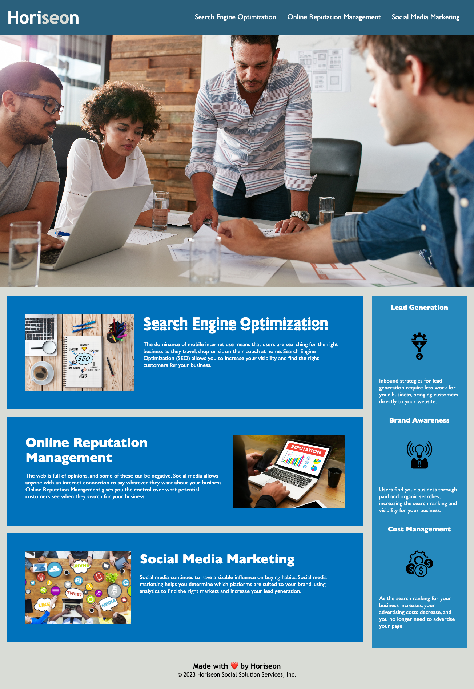

_This project was created for module 1 of the Front End Development bootcamp. In this challenge, we were tasked with refactoring code to make it more accessible for a fictional digital consultancy called Horiseon._

# Horiseon Homepage

## Description

This is a simple homepage for the digital consultancy, Horiseon. It outlines the three core services they offer and the three key benefits to potential customers. It was built to convey this information to potential customers in order to generate interest in the business. 

The website allows users to understand what the company offers - at a high level - quickly and easily. 

Accessibility needs have been considered throughout development in order to support those with accessibility needs and in order to improve SEO for the company. 

It has been written in a very traditional way with basic HTML and CSS. There is one JavaScript script in the website footer also. 

Building this simple website has helped me practise and refine my knowledge of some web development fundamentals. One learning that stands out is that there are so many ways to achieve the same outcome. I look forward to learning more about optimisation and efficient coding. 

**Here is the published website URL:** https://seandonnelly92.github.io/m1-challenge-horiseon/index.html

## Table of Contents (Optional)

If your README is long, add a table of contents to make it easy for users to find what they need.

- [Installation](#installation)
- [Usage](#usage)
- [Credits](#credits)
- [License](#license)

## Installation

You can see the live website by visting https://seandonnelly92.github.io/m1-challenge-horiseon/index.html. 

If you want to work on the software locally, here is one way of doing it

1. Go to https://github.com/seandonnelly92/m1-challenge-horiseon
2. Download the code repository by clicking the green 'Code' button and then 'Download Zip' as shown here

    

3. Navigate to your downloads folder an Unzip the repository folder. 
4. Move whole folder to a location where you want your project to be stored locally.
5. Open Visual Studio Code
6. Click File > Open Folder... 
7. Navigate to the location where you stored the repository
8. Select the folder
9. Click Open
10. Now you can work on the codebase locally! 

## Usage

Functionality is limited on the website, it mostly just displays information. The nav bar does contain four links: one is the logo which just redirects to the homepage. This will only be useful in future if other pages are added and the nav bar is updated. The other three links in the nav bar are internal anchor tags that scroll the relevant section on the homepage. Provide instructions and examples for use. 

Here is a screenshot of the live website: 
        

## Credits

I would like to thank EdX Skills for Life team including Abdul and all of the TAs for their support so far. 

I would also like thank OpenAI/ChatGPT. I used this to learn how to dynamiaclly include the current year in the copyright notice within the footer, which I believe is a useful piece of functionality. This was done with a JavaScript script. 

## License

MIT License

Copyright (c) 2023 seandonnelly92

Permission is hereby granted, free of charge, to any person obtaining a copy
of this software and associated documentation files (the "Software"), to deal
in the Software without restriction, including without limitation the rights
to use, copy, modify, merge, publish, distribute, sublicense, and/or sell
copies of the Software, and to permit persons to whom the Software is
furnished to do so, subject to the following conditions:

The above copyright notice and this permission notice shall be included in all
copies or substantial portions of the Software.

THE SOFTWARE IS PROVIDED "AS IS", WITHOUT WARRANTY OF ANY KIND, EXPRESS OR
IMPLIED, INCLUDING BUT NOT LIMITED TO THE WARRANTIES OF MERCHANTABILITY,
FITNESS FOR A PARTICULAR PURPOSE AND NONINFRINGEMENT. IN NO EVENT SHALL THE
AUTHORS OR COPYRIGHT HOLDERS BE LIABLE FOR ANY CLAIM, DAMAGES OR OTHER
LIABILITY, WHETHER IN AN ACTION OF CONTRACT, TORT OR OTHERWISE, ARISING FROM,
OUT OF OR IN CONNECTION WITH THE SOFTWARE OR THE USE OR OTHER DEALINGS IN THE
SOFTWARE.